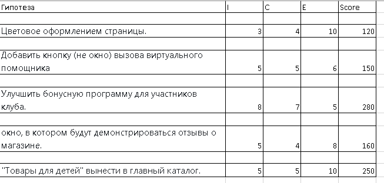

### На основе выбранных продуктов из первого вебинара, выберите 2 A/B-теста и составьте план эксперимента, чтобы избежать Peeking Problem

Распишите, какие метрики и как вы будете анализировать

## Приоритизация гипотез из второго урока с помощью ICE. На примере сайта магазина Ситилинк

Было принято решение, составить планы нескольких экспериментов для гипотез, набравших максимальное количество очков:

- улучшить бонусную программу для участников клуба;
- вынести в главный каталог "Товары для детей".

##  1.Улучшение бонусной программы для участников клуба.

### Гипотеза.

Применяем накопительную систему скидок. Скидка будет возвращаться в виде бонусов на счёте клиента (1 бонус = 1 рубль), которые нужно будет потратить в определенный период (например, полгода). Процент скидки будет зависеть от суммы, потраченной в магазине за всё время покупок и будет распространяться на акционные товары. В результате ожидаем рост продаж: увеличение суммы среднего чека минимум на 5% и снижение оттока на 10%.

### Действия.
**Контрольная версия**: оставляем текущий вид сайта с имеющейся бонусной программой.

**Тестовая версия**: меняем бонусную программу, акцентируя на ней внимание с помощью баннера вверху страницы.

**На каких пользователях тестируем**: на всех во всех регионах. 20% от общего количества.

**Метрики**:

Рост продаж — primary.
Количество новых зарегистриванных и совершивших покупку(конверсии) — secondary.

**План действий**:

Если  эксперимент будет положительным, и будет ожидаемое улучшение в ключевых метриках, то «выкатываем» изменение на всех пользователей.

Если основные метрики падают или растут недостаточно, зевершаем эксперимент.

Избежать Peeking problem:

Правильно рассчитываем длительность теста и придерживаемчя сроков, которые посчитали.

"Подсматриваем" промежуточные результаты эксперимента, но, если не происходит экстраординарных ситуаций, доводим эксперимент до конца и не принимаем решения на основе неполных данных.
__________________________

P.s. Данный экперимент можно разнообразить: менять условия бонусной программы. Например, _без бонусного счёта - скидка будет предоставляться сразу при покупке в зависимости от общей суммы, потраченной в магазине, но за определёный период (например, последние два года или год). На акционные товары не распространяется._ или ещё вариант - _скидка будет предоставляться сразу при покупке тоже в зависимости от общей суммы, потраченной за всё время в магазине, но процент скидки меньше, чем в первых двух вариантах. На акционные товары не распространяется._
____________________________
А также менять группы пользователей: _исследовать поведение двух групп посетителей: незарегистрированных и постоянных. Кроме этого, можно провести подобный эксперимент в группе постоянных пользователей - юр.лиц с большим средним чеком и высокой частотой покупок_.
____________________________
Метрики, которые можно проверять в группе незарегистрированных -
увеличение доли постоянных клиентов, т.е. тех, которые зарегистрировались, дали свои котакты, совершили хотя бы одну покупку. В группе постоянных клиентов исследуется рост продаж (средний чек), динамику изменения частоты покупок, снижение оттока. В процессе тестирования можно после покупки задавать пользователю из экспериментальных группы выборочно один вопрос: устраивает ли их такая программа.

## 2. Вынести в главный каталог "Товары для детей".

### Гипотеза.

Появление "Товаров для детей" в главном каталоге и увеличит  % конверсии в заказ на 5%, потому что привлечёт внимание новой группы покупателей - родителей.

### Действия.
**Контрольная версия**: оставляем текущий вид сайта со старым видом каталога.

**Тестовая версия**: меняем вид каталога и подсвечиваем "весёлым" цветом или фоном строчку "Товары для детей" (можно "обернуть" надпись мини-значками игрушек, шариков, гирлянд и т.п.).

**На каких пользователях тестируем**: на 50% всех пользователей из всех регионов .

**Метрики**:

Процент конверсии в заказ (%CR) — primary.
Средний чек заказа — secondary.

**План действий**:

Если  эксперимент будет положительным, и будет ожидаемое улучшение в ключевых метриках, то «выкатываем» изменение на всех пользователей.

Если основные метрики падают или растут недостаточно, зевершаем эксперимент.

Избежать Peeking problem:

Правильно рассчитываем длительность теста и придерживаемчя сроков, которые посчитали.

"Подсматриваем" промежуточные результаты эксперимента, но, если не происходит экстраординарных ситуаций, доводим эксперимент до конца и не принимаем решения на основе неполных данных.
__________________________
